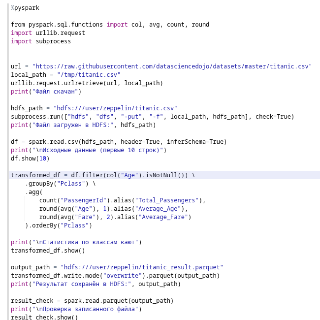
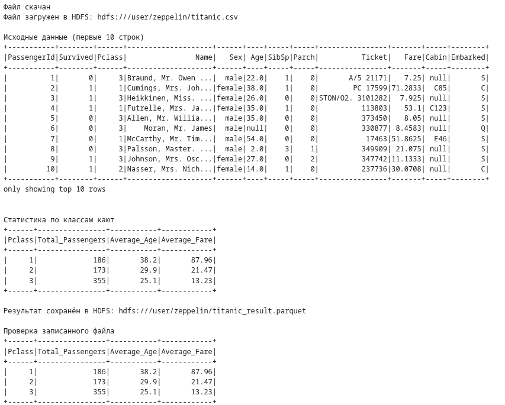
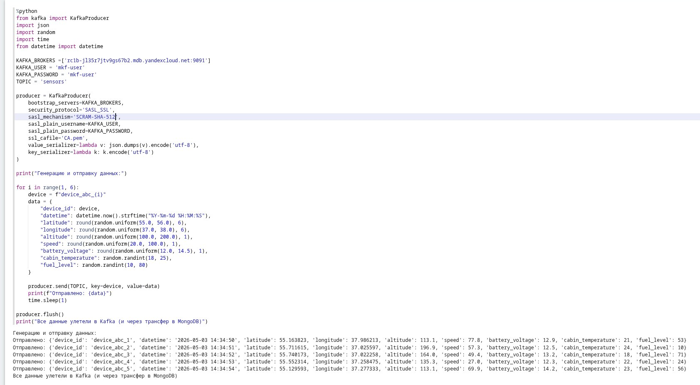
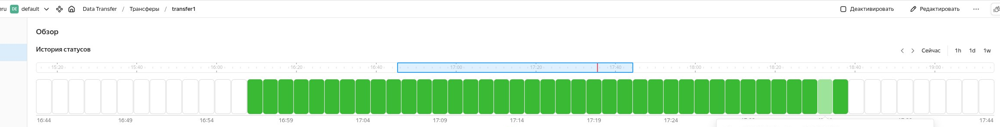
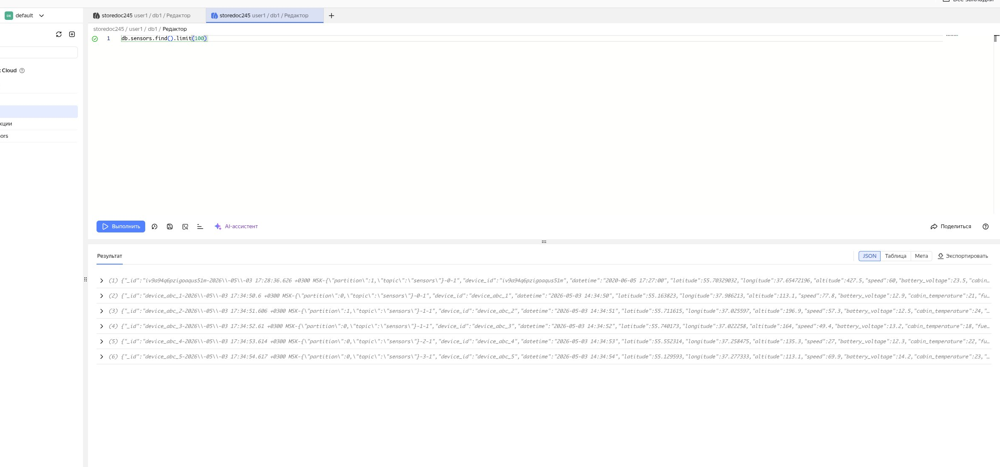

# Задание 11 и 12

Задание по обработке данных через Hadoop + Spark

Код обработки данных

Файл hadoop_spark.ipynb:

Данные до и после обработки:

Задание по созданию трансфера данных с кафки в базу данных. Отправка данных.
Файл kafka.ipynb:

Демонстрация успешного трансфера:

Отображение данных в бд:

