## Задание 1. Работа с Yandex DataTransfer

### 1. Создать БД Yandex DataBase.

Создаем БД в Managed Service for YDB. 
* Выбрал тип **Severless**, т.к. у него тарификация исходит из количества/сложности запросов пользователя.
* Тип нагрузки **OLTP**, потому что дашборды в datalens не будут напрямую брать данные из БД (соотвественно OLAP не нужен).

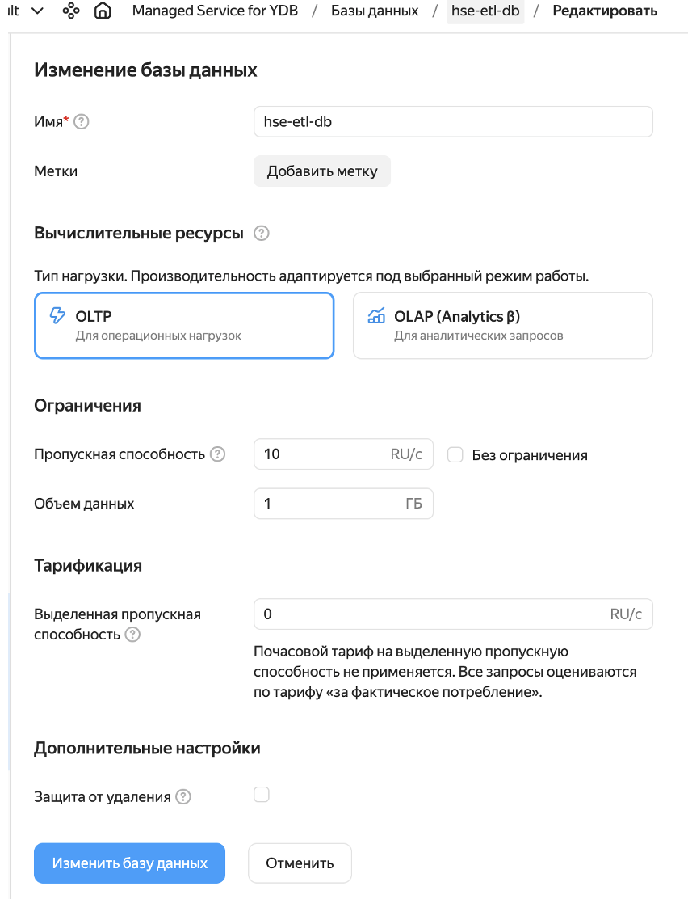

В [инструкции](https://yandex.cloud/ru/docs/data-transfer/tutorials/ydb-to-object-storage) указано, что предварительно нужно создать бакет в s3-хранилище и сервисный аккаунт. У меня они уже были, поэтому я только накинул дополнительные роли, которых не хватало сервисному аккаунту:

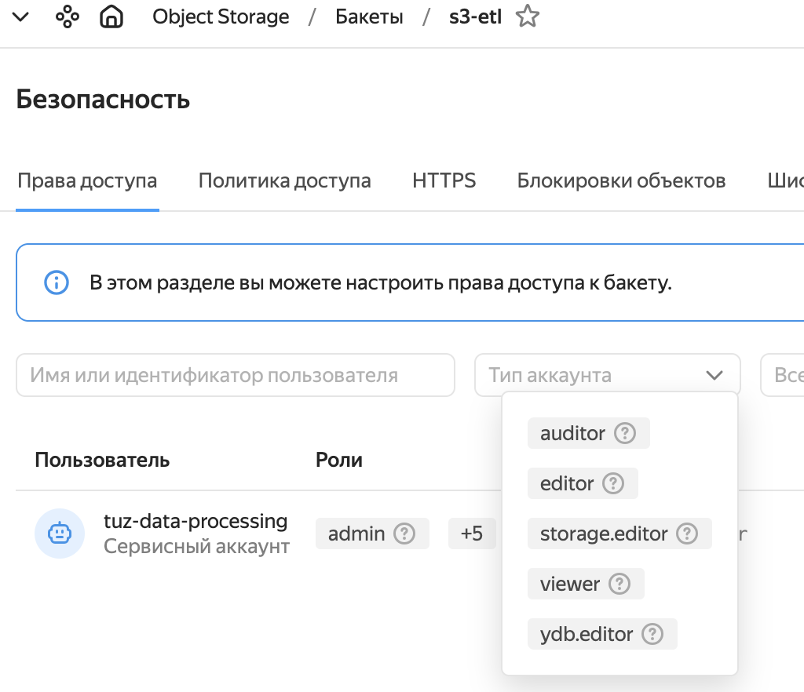

---

### 2. Подготовить данные.

В качестве датасета взял [transactions_v2](https://www.kaggle.com/datasets/bmurphmedia/transactions-v2) 

Создаем таблицу (01_createDB.sql):

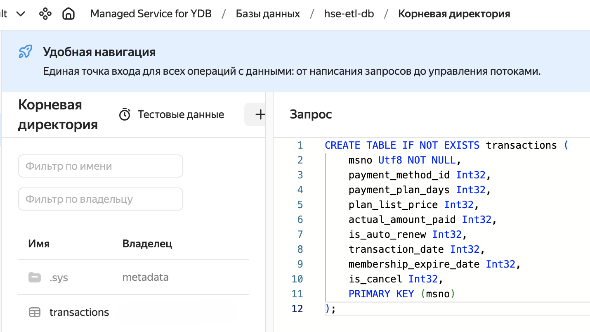

Через YDB CLI загрузил данные в БД:

```bash
ydb --profile abal  import file csv \
  --path transactions \
  --header \
  /Users/aleksandr/Downloads/transactions_v2.csv
```

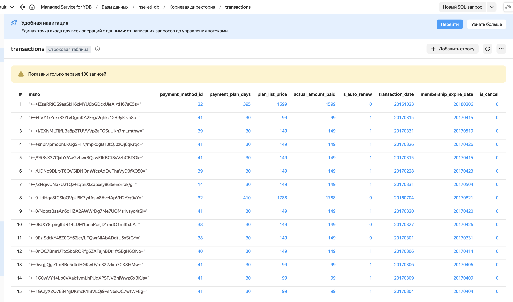

---

### 3. Создать трансфер в Object Storage.

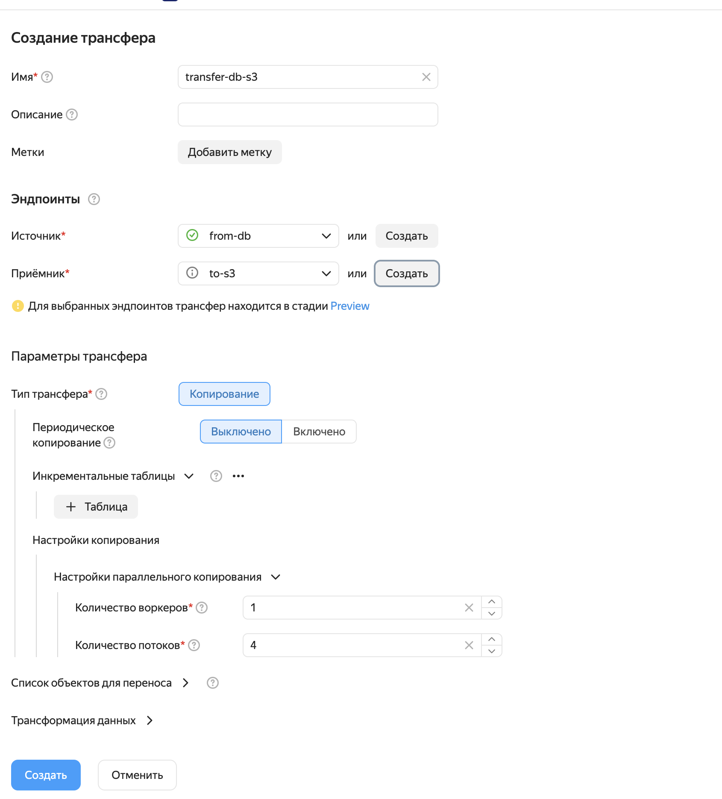

---

### 4. Проверить работоспособность трансфера

Трансфер корректно отработал:

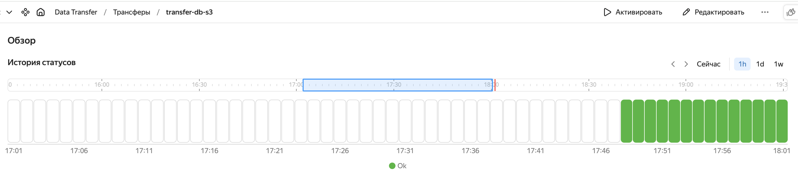

Результаты в S3:

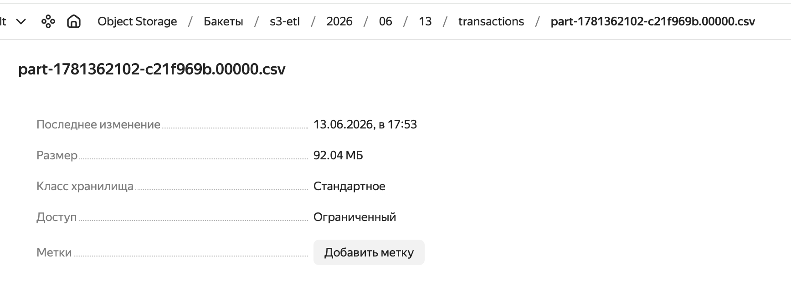

---

## Задание 2.Автоматизация работы с Yandex Data Processing при помощи Apache AirFlow.

В [документации](https://yandex.cloud/ru/docs/managed-airflow/tutorials/data-processing-automation) Предусмотрены два сценария:

* Упрощенная настройка
* Высокий уровень безопасности

Я выбрал **упрощенную настройку**

### 1. Подготовить инфраструктуру.

Часть инфраструктуры в плане настройки сетей, сервисного аккаунта были выполнены в предыдущих работах по предмету **Семинар наставника**, поэтому сюда прикреплю только новые сервисы:

Создание кластера Hive Metastore:

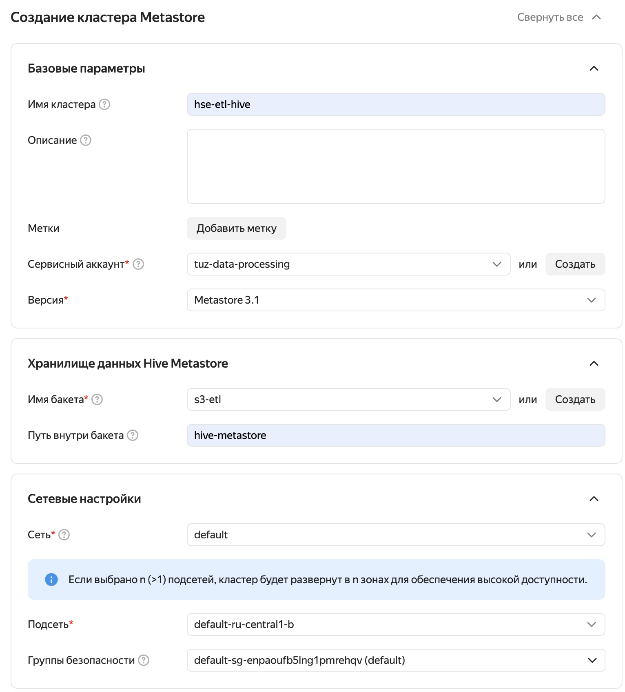

Создание кластера Apache Airflow:

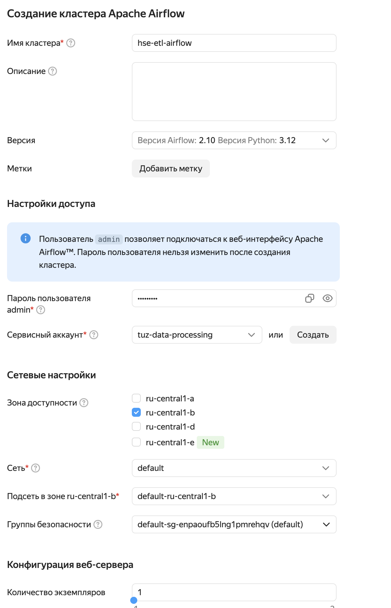

---

### 2. Подготовить PySpark-задание.

В качестве датасета использовал [Online Retail II UCI](https://www.kaggle.com/datasets/mashlyn/online-retail-ii-uci)

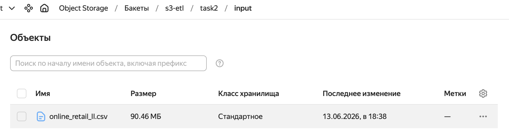

Загрузил измененный из инструкции скрипт `create-table.py`, который считывает csv файл из s3, а затем cоздает Spark таблицу:

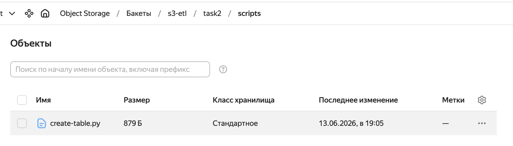

```python
from pyspark.sql.types import *
from pyspark.sql import SparkSession


BUCKET = "s3-etl"

INPUT_PATH = f"s3a://{BUCKET}/task2/input/online_retail_II.csv"
OUTPUT_PATH = f"s3a://{BUCKET}/task2/output"

spark = SparkSession.builder \
    .appName("create-table") \
    .enableHiveSupport() \
    .getOrCreate()

schema = StructType([
    StructField("Invoice", StringType(), True),
    StructField("StockCode", StringType(), True),
    StructField("Description", StringType(), True),
    StructField("Quantity", IntegerType(), True),
    StructField("InvoiceDate", StringType(), True),
    StructField("Price", DoubleType(), True),
    StructField("Customer ID", LongType(), True),
    StructField("Country", StringType(), True)
])

df = spark.read.option("header", "true").schema(schema).csv(INPUT_PATH)

spark.sql("DROP TABLE IF EXISTS result")

df.write.mode("overwrite").option("path", OUTPUT_PATH).saveAsTable("result")
```

---

### 3. Подготовить DAG-файл, запустить и проверить результат

Загрузил заполненный DAG-файл из инструкции `Data-Processing-DAG.py`, но понизил количество ресурсов (иначе DAG падает с ошибкой, т.к. запрашиваемое число SSD памяти больше лимита):

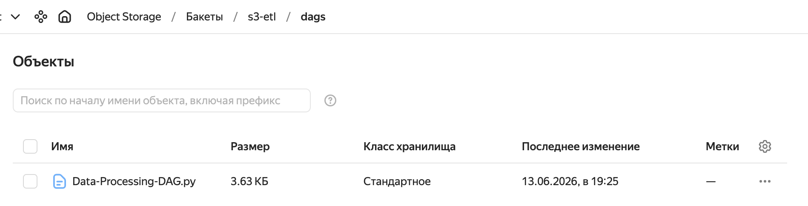

Проверка результатов в UI Airflow:

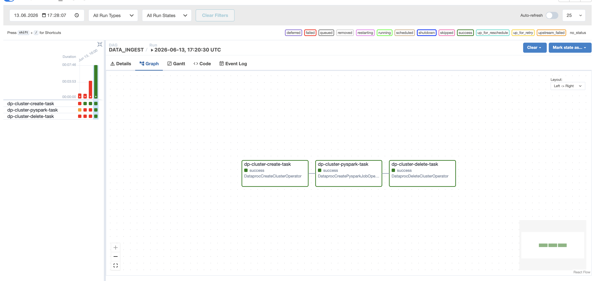

Результаты в S3:

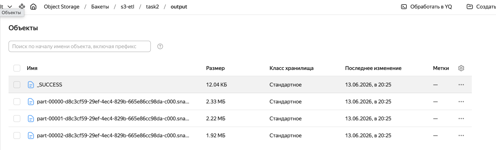